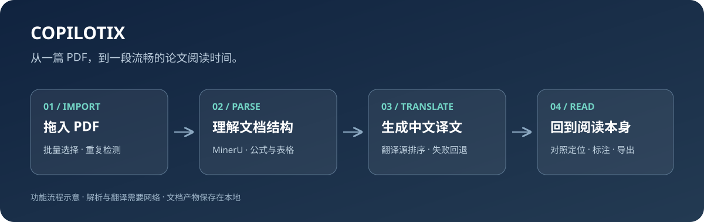
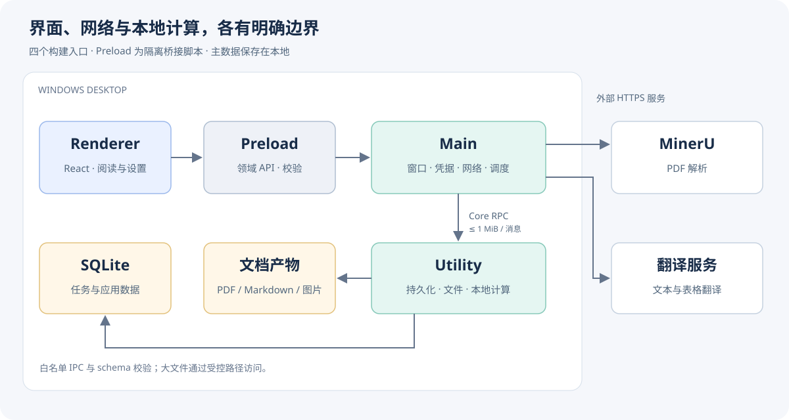
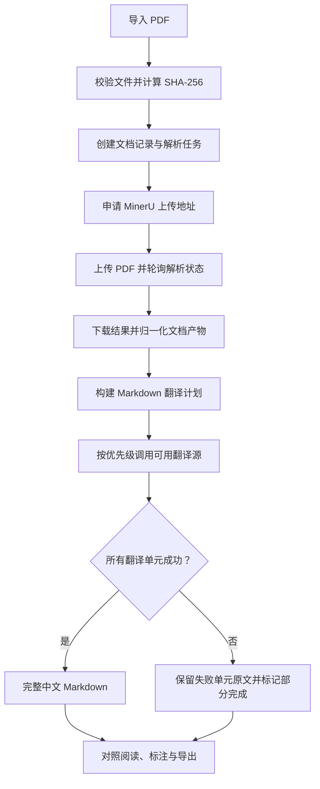

# 📚 Copilotix


**把一篇 PDF，变成可以对照阅读、标注与保存的中文论文工作区。**

读论文时，真正打断思路的往往是反复切换：看原文、查译文、找公式，再翻回表格所在的那一页。Copilotix 将这些步骤串在一个 Windows 桌面应用里：拖入 PDF，等待解析与翻译，在左侧原始版面和右侧结构化文本之间对照阅读。



<p align="center">
  <a href="#introduction">项目介绍</a> ·
  <a href="#quickstart">快速开始</a> ·
  <a href="#api-keys">申请 API Key</a> ·
  <a href="#tutorial">使用教程</a> ·
  <a href="#architecture">架构与算法</a> ·
  <a href="#development">开发与构建</a> ·
  <a href="#faq">常见问题</a>
</p>

> 本文介绍当前桌面实现与 Windows Setup 安装方式。图示用于解释功能与架构，不是应用截图。

<a id="introduction"></a>

## ✨ 项目介绍

Copilotix 是面向论文处理与阅读的个人桌面客户端。**PDF 解析使用 MinerU 服务**，翻译由所选翻译服务完成，任务记录和文档产物保存到本地。桌面应用直接连接在线服务，不需要安装 Python 或本地解析模型。

### 你可以用它做什么？

| 阅读环节 | 已实现功能 |
| --- | --- |
| 📥 收集论文 | 拖入或多选 PDF；按文件内容识别重复导入 |
| 🧩 解析内容 | 调用 MinerU，获取 Markdown、版面数据和图片资源；请求启用公式与表格识别 |
| 🌏 阅读中文 | 解析完成后自动翻译为简体中文；支持翻译源排序、失败回退和部分完成后的重试 |
| 🔎 对照原文 | 同屏查看 PDF 与原文/中文 Markdown；按内容块联动定位和高亮 |
| 🖍️ 留下重点 | 在 Markdown 文本中使用荧光笔与下划线，分别保存原文和译文标注 |
| 📦 带走结果 | 复制当前内容、另存 Markdown、导出完整结果 ZIP、打开输出目录 |
| 🗂️ 管理任务 | 查看进度，按名称与状态筛选，重试失败或部分完成的任务 |

**适用平台：Windows x64。** 当前正式导入格式为 PDF；Markdown 是解析与翻译产物。解析和翻译需要网络，已经落盘的产物保留在本机。公式、图表、译文和定位效果受源文件及服务返回结果影响，阅读时可随时对照原始 PDF。

<a id="quickstart"></a>

## 🚀 快速开始

### 方式一：使用 Setup 安装（推荐）

1. 查看仓库的 [Releases](https://github.com/Kumiko-kmk/Copilotix/releases)。**若已发布**对应版本，下载 `Copilotix-<版本>-win-x64.zip`，完整解压后运行其中的 `Copilotix-Setup-<版本>-x64.exe`。也提供较小的独立 Setup 下载。
2. 运行安装精灵，选择当前用户可写的安装位置，并按需要创建桌面快捷方式。完成后从桌面或开始菜单启动 Copilotix。
3. 打开「设置 → 服务连接」，配置并保存 MinerU Token。
4. 返回「新解析」，选择一篇 PDF，点击「开始解析」。
5. 在「任务管理」查看进度，点击任务名称进入阅读器。

更新前先等待任务完成，并通过托盘菜单退出 Copilotix；关闭窗口可能仍在后台运行。再次运行新版 Setup 可覆盖升级。安装目录和文档保存目录独立：设置、凭据与数据库继续使用 `%APPDATA%\Copilotix-Translation-v2` 及原有文档库。运行安装目录中的 `uninstall.exe` 或通过 Windows「设置 → 应用」卸载，默认保留个人数据；也可勾选清除文库、设置与凭据并再次确认。详细步骤见 [安装、升级与卸载指南](docs/WINDOWS_INSTALLATION_ZH.md)。

精简 ZIP 包含 Setup、`uninstall.exe`、安装说明及校验文件；完整程序已嵌入 Setup，安装后即可运行，无需另外下载运行目录。升级无需搬移文档库，请先退出正在运行的应用。若 Releases 暂无安装包，可使用下方源码启动方式。

### 方式二：从源码启动

准备 Git、Node.js **24.19.0** 和 pnpm **11.19.0**；版本分别见 [`.node-version`](.node-version) 与 [`package.json`](package.json)。

```powershell
git clone --branch master --single-branch https://github.com/Kumiko-kmk/Copilotix.git
cd Copilotix
npm install --global pnpm@11.19.0
pnpm install
pnpm desktop:dev
```

以上命令克隆远端 master；远端可能尚未包含本地待发布的更改。在已有本地 master 工作区中开发时，从安装依赖这一步开始即可。桌面工作流不要求安装 Python、CUDA 或下载解析模型。

<a id="api-keys"></a>

## 🔑 申请并配置 API Key

Copilotix 不发放服务商密钥。请在相应服务的官方网站创建凭据，再填入应用的「设置 → 服务连接」。**测试连接成功后，还需点击「保存全部更改」。**

| 服务 | 用途 | 是否必需 | 当前接入方式 |
| --- | --- | --- | --- |
| MinerU | 上传并解析 PDF | 必需 | MinerU API Token，v4 API |
| Qwen / 千问 | 中文翻译 | 可选 | 阿里云百炼 API Key，`qwen-mt-plus` |
| DeepSeek | 中文翻译 | 可选 | DeepSeek API Key，`deepseek-flash` |
| Bing | 中文翻译与回退 | 无需在应用填写 Key | 网页翻译接口 |
| 腾讯 TranSmart | 中文翻译与回退 | 无需在应用填写 Key | 网页翻译接口 |

Bing 和 TranSmart 的接入依赖第三方网页接口，可用性可能变化。需要更可控的翻译体验时，可配置 Qwen 或 DeepSeek。配额、费用、账号开通要求以服务商控制台为准。

### 1. MinerU：让 PDF 变成结构化内容

1. 打开 [MinerU Token 管理页](https://mineru.net/apiManage/token)，注册或登录。
2. 在 API 管理的 Token 页面申请或获取 Token，检查页面显示的有效期和可用额度。
3. 打开 Copilotix「设置 → 服务连接 → MinerU」，粘贴 Token 本身，不添加 `Bearer ` 前缀。
4. 点击「测试连接」，成功后点击「保存全部更改」。
5. 确认凭据状态为「已验证」，再创建解析任务。

解析接入的正式名称是 **MinerU**，应用代码中的 `Parser API Token` 指的就是这项凭据。申请步骤可对照 [MinerU 官方教程](https://github.com/opendatalab/mineru-tutorials/blob/main/03%E8%AF%BE%EF%BC%9AMinerU%20%E5%9C%A8%E7%BA%BF%20API%20%E5%AE%9E%E6%88%98%E6%95%99%E7%A8%8B/03%E8%AF%BE%EF%BC%9AMinerU%20%E5%9C%A8%E7%BA%BF%20API%20%E5%AE%9E%E6%88%98%E6%95%99%E7%A8%8B%20-%20%E6%96%87%E6%A1%A3.md)。

### 2. Qwen：申请阿里云百炼 Key

1. 登录 [阿里云百炼控制台](https://bailian.console.aliyun.com/)，按控制台提示开通服务。
2. 进入 API Key 管理页面，选择与当前接入域名对应的**华北 2（北京）**地域。
3. 创建 API Key；所选业务空间和权限需允许调用 `qwen-mt-plus`。
4. 将 Key 填入 Copilotix 的「Qwen」卡片，测试连接并保存。

当前代码固定使用 `https://dashscope.aliyuncs.com/compatible-mode/v1`。百炼不同地域的 Key 与接入域名不能混用；请使用适用于该地址的百炼模型 API Key。具体入口与操作见 [阿里云官方 API Key 文档](https://help.aliyun.com/zh/model-studio/get-api-key)。

### 3. DeepSeek：申请开放平台 Key

1. 打开 [DeepSeek 开放平台](https://platform.deepseek.com/)，注册或登录。
2. 在 [API Keys](https://platform.deepseek.com/api_keys) 页面创建并复制 Key。
3. 检查账号可用余额与模型调用权限。
4. 将 Key 填入 Copilotix 的「DeepSeek」卡片，测试连接并保存。

当前代码使用 `https://api.deepseek.com` 和 `deepseek-flash`。接入说明见 [DeepSeek 官方文档](https://api-docs.deepseek.com/zh-cn/)。

### 保存之后会发生什么？

应用保存前会验证候选凭据，有效凭据通过系统凭据存储保存；界面仅回显掩码和验证状态。某个字段验证失败时，普通设置和其他有效凭据仍可保存，请按字段错误提示修正。

模型地址与名称由当前版本固定，设置页提供翻译源的启用和优先级调整。不要把某家服务的 Key 填到另一家的卡片中，也不要把真实 Key 放进 README、截图或 Issue。

<a id="tutorial"></a>

## 📖 使用教程：完成第一篇论文

### 第一步：设置翻译顺序与保存目录

在「设置 → 模型设置」启用所需翻译源，通过拖拽或键盘调整顺序，然后保存。默认顺序是 **Qwen → DeepSeek → Bing → TranSmart**；运行时会跳过未启用的服务，以及没有有效凭据的 Qwen、DeepSeek。

在「设置 → 文件存储」选择文档保存位置。默认位置为 Windows 文档目录下的 `Copilotix`。**修改位置只影响新任务，不会搬移既有文档。** 页面还提供存储用量、打开目录及文档库管理入口。

### 第二步：导入 PDF

在「新解析」拖入一个或多个 PDF，或点击「选择文档」。确认列表中的文件后：

- 「跳过重复文件」默认勾选，按文件内容摘要识别重复项。
- 「使用原文件名」默认不勾选，可根据自己的整理习惯启用。
- 单个文件本地上限为 **200 MiB**（界面显示 200 MB）；服务端还可能有自己的页数、额度等限制。
- 点击「开始解析」，任务进入队列。

导入完成后，应用自动执行解析，并在解析成功后安排翻译。无需手动上传解析产物或再次点击翻译。

### 第三步：观察进度

「任务管理」会展示排队中、上传中、解析中、翻译中、部分完成、已完成或失败等状态。你可以按名称和状态筛选，点击任务名称打开阅读器。

「部分完成」意味着有翻译单元未成功，失败部分会保留原文。可以先阅读已有结果，再重试未完成部分；不要将其等同于全文已翻译成功。

### 第四步：在原文与译文之间对照

阅读器左侧展示 PDF，右侧可切换解析 Markdown、中文 Markdown 和 JSON 数据。

- 点击 PDF 内容块或 Markdown 区块，可联动定位与高亮，减少来回寻找上下文。
- Markdown 滚动可更新对应内容块；实际定位依赖解析返回的版面映射。
- 在 Markdown 中选中文字，使用荧光笔或下划线留下重点。
- 复制当前文本，或查看 JSON 来检查解析结构。

这是基于内容块的定位，不是逐句对齐的承诺，也不保证 PDF 与 Markdown 两侧滚动完全镜像。翻译尚未完成时，中文面板会展示相应进度或等待状态。

### 第五步：导出与整理

阅读器支持另存当前 Markdown、另存完整结果 ZIP，以及打开输出目录。需要把含图片的内容带到其他电脑时，可优先使用完整结果 ZIP。

典型文档目录如下；可选文件以服务返回和实际处理结果为准：

```text
<文档保存位置>/
└── documents-v2/
    └── <documentId>/
        ├── original.pdf
        ├── full.md
        ├── full.zh-CN.md
        ├── layout.json
        ├── block_list.json
        └── … 图片与其他解析产物
```

任务数据库默认位于 `%APPDATA%\Copilotix-Translation-v2\copilotix-desktop-v2.sqlite3`。结果 ZIP 用于分享文档产物，不是包含任务数据库、凭据和所有应用状态的完整备份。
### 🗃️ 备份、恢复与迁移文档库

在「设置 → 文件存储 → 文档库管理」操作：


| 操作 | 用途 | 数据保护 |
| --- | --- | --- |
| 创建备份 | 保存原始 PDF、处理产物、批注与数据库 | 逐文件 SHA-256 校验；不包含系统凭据 |
| 恢复备份 | 从包含 `manifest.json` 的备份目录恢复 | 先备份当前库，校验后整体替换；保留原文件 |
| 迁移文档库 | 将已有文档移到另一个空目录 | 复制并校验后切换路径；保留旧目录 |

请先等待排队和运行中的任务结束。恢复与迁移完成后应用会自动重启；跨电脑恢复需重新配置 API Key。恢复要求备份与当前应用的数据库结构一致。备份目录请完整保存，它不是单个 ZIP。

详细范围、磁盘空间要求与失败处理见 [文档库管理指南](docs/LIBRARY_MANAGEMENT_ZH.md)。

任务删除框中的「同时删除本地结果文件」会额外删除对应本地文件，请按需要选择。

<a id="architecture"></a>

## 🏗️ 项目架构

桌面端采用 **Main、Preload、Renderer、Utility 四个构建入口**。其中 Preload 是隔离的桥接脚本，不是独立进程。



| 模块 | 主要职责 | 源码入口 |
| --- | --- | --- |
| Renderer | React 界面、任务列表、设置、PDF 与 Markdown 阅读 | [renderer](desktop/src/renderer) |
| Preload | 将受控领域 API 暴露为 `window.copilotix`；验证请求与响应 | [preload/index.ts](desktop/src/preload/index.ts) |
| Main | 窗口、凭据、网络请求、任务编排与 Utility 监督 | [main/index.ts](desktop/src/main/index.ts) |
| Utility | SQLite 持久化、文件操作、产物归一化与翻译计划计算 | [utility/index.ts](desktop/src/utility/index.ts) |

界面启用 sandbox，通过白名单接口操作文档；Main 与 Utility 使用版本化 Core RPC。跨进程传递经过校验的小型消息，单个 payload/envelope 上限为 1 MiB；PDF、ZIP 等大文件不作为消息正文搬运。SQLite 由 Utility 持有，文档文件按受控路径写入。

### 关键流程



<a id="algorithms"></a>

## 🧠 重要算法与接口

### 1. 文档导入与解析结果归一化

导入时计算 SHA-256，用于重复文件判断；原始文件通过临时写入、同步与重命名落盘。解析任务使用文档 ID 关联 MinerU 的 `data_id`，避免将批次结果分配给错误文档。

解析结果下载后，Utility 检查必要的 Markdown 和 layout 数据，生成内容块映射与产物摘要，再发布到文档目录。可选 `content_list.json` 不作为所有文档必有的文件。

源码：[documentCommandService.ts](desktop/src/main/documentCommandService.ts)、[parserClient.ts](desktop/src/main/parserClient.ts)、[utilityOperations.ts](desktop/src/utility/core/utilityOperations.ts)。

### 2. 保留结构的 Markdown 与表格翻译

普通 Markdown 经 AST 分解为翻译单元，代码、公式等受保护节点不作为普通正文翻译。系统按规范化文本、顺序游标和锚点匹配版面内容块。

表格翻译保留行列、单元格跨度和结构，将需要翻译的文本片段分配稳定 ID。返回内容通过 schema 与片段 ID 完整性校验后，才用于生成结果；Qwen 翻译模型与其他服务的请求方式分别适配。这样可以降低整段自由生成导致表格结构被改写的风险。

源码：[markdownTranslationPlan.ts](desktop/src/utility/core/compute/markdownTranslationPlan.ts)、[tableTranslation.ts](desktop/src/utility/core/compute/tableTranslation.ts)、[translationPlanProtocol.ts](desktop/src/shared/translationPlanProtocol.ts)。

### 3. 缓存、回退与可恢复翻译计划

翻译按保存的服务顺序尝试可用 provider，并使用缓存与有限次数的可重试请求。计划保存源文件与映射摘要、算法版本和各单元结果，恢复时据此检查已有进度；失败单元保留原文，支持后续重试。

任务状态与 checkpoint 持久化，Utility 异常退出后有有限次数的重启机制。这些机制降低重复工作的成本，但不意味着所有网络故障或中断都会自动恢复成功。

源码：[translationPlanOrchestrator.ts](desktop/src/main/translation/translationPlanOrchestrator.ts)、[jobScheduler.ts](desktop/src/main/jobScheduler.ts)、[utilitySupervisor.ts](desktop/src/main/utilitySupervisor.ts)。

### 4. PDF 与 Markdown 的内容块映射

版面数据中的页码和 bounding box 被整理为稳定映射；原文和有效的译文索引共享这套映射。阅读器借助映射实现内容块定位与高亮；索引不可信时会取消相关映射，避免错误跳转。

源码：[blockMapping.ts](desktop/src/core/blockMapping.ts)、[readerDocument.ts](desktop/src/shared/readerDocument.ts)、[ReaderPage.tsx](desktop/src/renderer/pages/ReaderPage.tsx)。

### 5. 主要接口

**应用内部 API** 通过 Preload 暴露，不是供公网调用的 HTTP 服务：

| 领域 | 代表接口 | 用途 |
| --- | --- | --- |
| 设置与凭据 | `getSettings`、`saveSettings`、`validateCredential` | 获取设置、验证与保存凭据 |
| 文档任务 | `importDocuments`、`listDocuments`、`getDocument` | 导入和查询 |
| 任务操作 | `retryDocument`、`deleteDocument` | 重试与删除 |
| 导出 | `saveDocumentAs`、`openDocumentOutput` | 保存结果与打开目录 |
| 阅读标注 | `listReaderAnnotations`、`mutateReaderAnnotations` | 查询和修改标注 |
| 事件 | `onDocumentsChanged` | 订阅文档变化，返回取消订阅函数 |

参数和返回值以 [IPC schemas](desktop/src/shared/ipcSchemas.ts)、[共享类型](desktop/src/shared/types.ts) 和 [Preload 实现](desktop/src/preload/index.ts) 为准。

**外部服务接口**：

| 接口 | 作用 |
| --- | --- |
| `POST https://mineru.net/api/v4/file-urls/batch` | 申请 PDF 批量上传地址 |
| 服务返回的 HTTPS 上传地址 | 上传 PDF 文件 |
| `GET https://mineru.net/api/v4/extract-results/batch/{batchId}` | 查询解析状态与结果地址 |
| Qwen / DeepSeek 的 `POST …/chat/completions` | 执行翻译请求 |

实际鉴权、超时、轮询和错误处理见 [解析客户端](desktop/src/main/parserClient.ts) 与 [翻译适配器](desktop/src/main/translation/providers.ts)。Bing、TranSmart 使用单独的网页接口适配器。

<a id="development"></a>

## 🛠️ 开发与构建

```text
Copilotix/
├── desktop/
│   ├── src/
│   │   ├── main/          # Electron 主进程与任务编排
│   │   ├── preload/       # 隔离桥接 API
│   │   ├── renderer/      # React 界面与阅读器
│   │   ├── shared/        # 类型、协议和校验
│   │   ├── core/          # RPC 客户端与内容块映射等
│   │   └── utility/       # SQLite、文件与计算
│   ├── tests/             # 单元与组件测试
│   ├── e2e/               # Playwright 测试
│   └── scripts/           # 构建及发布检查
├── docs/                  # 开发、架构及安全文档
└── release/               # 本地构建生成的发行目录
```

发布前的基本检查与打包命令：

```powershell
pnpm desktop:typecheck
pnpm desktop:lint
pnpm desktop:test
pnpm desktop:release
```

需要覆盖率或端到端验证时：

```powershell
pnpm desktop:test:coverage
pnpm desktop:test:e2e
```

发布脚本同时生成 Setup、完整运行目录与 ZIP，当前版本的典型路径为：

```text
release/Copilotix-Setup-0.1.0-x64.exe
release/安装说明.txt
release-artifacts/<build-id>/program/Copilotix.exe
release/uninstall.exe
release-artifacts/<build-id>/Copilotix-0.1.0-win-x64.zip
```

发布流程包含 bundle、ASAR、资源、Setup/ZIP 哈希、独立体积门槛与 packaged CLI smoke 检查。**CLI smoke 不等于 GUI 端到端测试通过**，正式发布仍需验证安装、升级、卸载，以及导入、阅读和导出。正式签名与完整发布门禁见 [Windows 桌面发布](docs/DESKTOP_RELEASE_ZH.md)。

贡献前请阅读 [AGENTS.md](AGENTS.md)。更多技术背景见 [桌面开发说明](docs/DESKTOP_DEVELOPMENT_ZH.md)、[架构文档](docs/ARCHITECTURE_ZH.md) 和 [安全策略](docs/SECURITY.md)。

<a id="privacy"></a>

## 🔒 数据与凭据

PDF 会上传至解析服务提供的地址；待翻译文本会发往实际执行的翻译服务。任务数据库、原文件和处理产物保存到本地，翻译 Key 与解析 Token 通过系统凭据存储管理。

翻译源发生回退时，文本可能发送给下一项启用的服务。如果只希望使用特定服务，请在模型设置中关闭其他翻译源并保存。不要将“文档保存在本地”理解为“处理过程完全离线”。

<a id="faq"></a>

## 💬 常见问题

| 问题 | 建议检查 |
| --- | --- |
| 无法开始解析 | MinerU Token 是否已验证并保存；PDF 是否超过文件大小限制 |
| 测试连接失败 | Key 是否属于对应平台；是否过期；网络、余额及模型权限是否正常 |
| Qwen Key 正确但不可用 | 是否为北京地域、是否匹配当前 DashScope 地址、是否具备模型权限 |
| 没有 Qwen 或 DeepSeek Key | 仍可使用已启用的 Bing / TranSmart；它们需要网络且可用性受第三方接口影响 |
| 长时间排队或解析失败 | 检查服务端额度、网络和任务错误信息，再重试 |
| 部分内容仍是原文 | 查看是否为“部分完成”；公式、代码和按规则保留的内容也不会作为普通正文翻译 |
| 改了保存位置，旧文件没过去 | 修改目录只作用于新任务，既有文档保留原位置 |
| Markdown 图片分享后打不开 | 确认关联图片一并保留；可使用完整结果 ZIP |
| 只复制 EXE 后无法运行 | 重新完整解压发行 ZIP，并保留所有运行依赖 |
| 能直接导入 Markdown 吗？ | 当前正式支持 PDF 导入；Markdown 用于解析、翻译和导出结果 |

报告问题时，请提供应用版本、Windows 版本、复现步骤与经过脱敏的错误信息。可以通过 [GitHub Issues](https://github.com/Kumiko-kmk/Copilotix/issues) 反馈。

## 📄 许可证与致谢

项目使用 MinerU 进行 PDF 解析，并依赖 Electron、React、PDF.js 等开源组件。

Copilotix 自有代码采用 [MIT 许可证](LICENSE.md)，Copyright © 2026 Kumiko-kmk。允许使用、修改与商用分发，须保留版权及许可文本。依赖和外部服务保留各自条款，见 [第三方声明](THIRD_PARTY_NOTICES.md)。签名配置见 [许可证与签名指南](docs/LICENSE_AND_SIGNING_ZH.md)。

### Code signing policy

签名服务尚未获批；当前状态、审核角色与数据传输说明见 [Code signing policy](docs/CODE_SIGNING_POLICY.md)。
