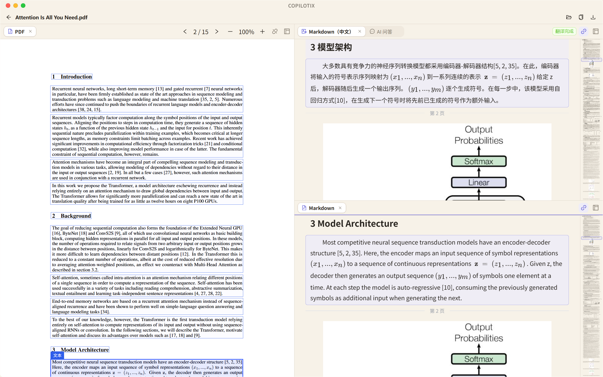

# 📚 Copilotix

**把 PDF 解析、中文翻译、原文对照与论文 AI 问答，放进同一个阅读工作台。**

Copilotix 是面向论文阅读的 Windows 桌面应用。导入 PDF，经 MinerU 在线解析和所选服务翻译；在 PDF、原文、中文和 AI 问答四个视图之间自由分组。文献产物、聊天与草稿保存在本地，重新打开后继续阅读。

**当前版本：1.1.0 · Windows x64**

[下载安装](https://github.com/Kumiko-kmk/Copilotix/releases/tag/desktop-v1.1.0) · [中文 Wiki](https://github.com/Kumiko-kmk/Copilotix/wiki) · [完整更新说明](docs/releases/1.1.0.zh-CN.md) · [反馈问题](https://github.com/Kumiko-kmk/Copilotix/issues)



*实际运行截图：《Attention Is All You Need》的独立示例文库，左侧 PDF，右侧中文与原文上下分组。*

## ✨ 1.1.0 的主要功能

- **阅读工作台**：四视图自由拆分、拖动、关闭后重开与分组最大化；恢复布局，原文／中文按内容块联动，PDF 可单独启用同步。
- **论文问答**：Qwen／DeepSeek 内置模型，支持加入选区和引用定位；按文献保存对话、完整回答、草稿、选区与模型，重开后恢复。
- **紧凑阅读**：清除 PDF 外围、右侧、底部及页间额外留白；浮动滚动条不占版面，调整宽度和缩放保留页码与页内位置；减小正文段落间距。
- **翻译与标注**：翻译源顺序、失败回退与部分重试；保留 HTML 合并表格与 LaTeX 数学内容，原文和中文分别标注。
- **导出与文库**：另存标准 Markdown 及相邻图片、导出结果 ZIP；完整文库备份、恢复和迁移。

正式导入格式为 **PDF**。JSON 阅读视图和自定义模型入口已移除，底层版面产物与既有聊天历史保留。

## 🚀 三步开始

1. 从 [1.1.0 Release](https://github.com/Kumiko-kmk/Copilotix/releases/tag/desktop-v1.1.0) 下载 `Copilotix-1.1.0-win-x64.zip`，完整解压并运行 `setup.exe`；也可直接下载独立 Setup。
2. 在「设置 → 服务连接」验证 MinerU Token 和所需服务，点击「保存全部更改」；确认翻译来源与文献保存位置。
3. 选择或拖入 PDF，在任务管理中打开文献；按需拆分对照阅读，进入 AI 问答前确认接收服务与发送内容。

> **1.1.0 经授权以未签章形式发布。** 请从本仓库 Release 下载，并用同页 `SHA256SUMS.txt` 核对文件；后续正式签章要求仍保留。安装、覆盖升级及资料保留见 [Wiki 安装指南](https://github.com/Kumiko-kmk/Copilotix/wiki/Installation-and-Upgrade)。

## 🔑 服务与模型

程序不附带 API Key。问答和翻译共用对应服务凭据，分别选择模型，切换问答模型不会修改翻译配置。

| 服务 | 解析／翻译 | 论文问答 |
| --- | --- | --- |
| MinerU | 在线 PDF 解析 | — |
| Qwen／千问 | `qwen-mt-plus` | `qwen-plus`、`qwen3.8-flash`、`qwen3.8-max` |
| DeepSeek | `deepseek-flash` | `deepseek-flash`、`deepseek-v4-pro` |
| Bing／腾讯 TranSmart | 无需 Key 的网页翻译来源 | — |

模型为 **1.1.0 内置选择项**，实际可用性以服务商、账号和地域为准。Qwen 当前接入北京地域 DashScope，Key 与地域须匹配。默认翻译顺序为 Qwen → DeepSeek → Bing → TranSmart，跳过未启用或缺少有效凭据的服务；只向指定来源发送时关闭其他来源。

凭据申请、验证与权限说明见 [Wiki 服务配置](https://github.com/Kumiko-kmk/Copilotix/wiki/Service-Setup)。

## 💾 本地资料与发送范围

文献保存在 `<文档保存位置>/documents-v2/<documentId>/`：PDF、原文、译文、图片和版面信息；`chat/` 保存会话及对话轮次，API Key 由 Windows 系统凭据存储管理。

解析上传 PDF 到 MinerU；翻译向实际来源发送文本；问答发送问题、近期对话、选区及文献片段，短论文可能发送完整已解析文本，首次发送需确认。

**结果 ZIP 包含已有聊天、草稿和选区，分享前检查内容。** 文库备份另含数据库及已保存设置，不含系统凭据；修改保存位置只影响新任务，搬移旧库使用迁移功能。

## 📖 分步指南

| 想了解什么 | Wiki |
| --- | --- |
| 导入、任务状态、对照阅读与导出 | [第一篇论文](https://github.com/Kumiko-kmk/Copilotix/wiki/First-Paper) |
| 拆分、同步、标注与快捷键 | [阅读工作台](https://github.com/Kumiko-kmk/Copilotix/wiki/Reader-Workbench) |
| 模型、选区、引用与聊天恢复 | [论文 AI 问答](https://github.com/Kumiko-kmk/Copilotix/wiki/Paper-AI-Chat) |
| 文件目录、导出、备份与迁移 | [本地资料与导出](https://github.com/Kumiko-kmk/Copilotix/wiki/Local-Data-and-Export) |
| 凭据、任务或界面问题 | [常见问题](https://github.com/Kumiko-kmk/Copilotix/wiki/FAQ) |

Wiki 按主题提供截图，以及 [解析流程示意图](docs/images/pdf-structure-source.png) 和 [本地文件示意图](docs/images/local-paper-files-1.1.0.png)。

## 🛠️ 开发

使用 **Node.js 24.19.0、pnpm 11.19.0**；桌面应用采用 Electron／React，SQLite 与文件处理在独立 Utility 中执行，不需要 Python 或 CUDA。

```powershell
pnpm install
pnpm desktop:dev
# 生成本地安装包
pnpm desktop:build:bundles
pnpm desktop:release:from-built
```

源码构建的 `program/Copilotix.exe` 必须连同完整运行目录使用。开发流程见 [AGENTS.md](AGENTS.md) 和 [工程文档](docs/README.md)，Wiki 源文件在 [docs/wiki](docs/wiki)。正式合并与发布遵守 [Windows CI](https://github.com/Kumiko-kmk/Copilotix/actions/workflows/desktop-windows.yml) 和 [签章政策](docs/CODE_SIGNING_POLICY.md)。

## 📄 许可与致谢

自有代码采用 [MIT](LICENSE.md)，依赖与服务保留各自条款，见 [第三方声明](THIRD_PARTY_NOTICES.md)。感谢 MinerU、Electron、React、PDF.js 等项目。示例论文：[Attention Is All You Need](https://arxiv.org/abs/1706.03762)。安全问题按 [Security Policy](docs/SECURITY.md) 报告。
