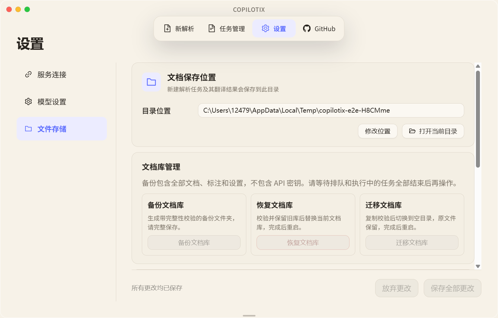

# 文档库备份、恢复与迁移

入口：设置 → 文件存储 → 文档库管理。

截图使用临时测试文档库。

- 备份：选择父目录，生成 Copilotix-backup-日期-标识 文件夹。包含数据库、全部文档产物、标注、翻译缓存及已保存设置。API 密钥由系统凭据管理，不进入备份。
- 恢复：选择包含 manifest.json 的完整备份文件夹。校验成功后先备份当前库至 userData/library-recovery，再复制源文档至新目录，通过单个数据库事务替换数据，完成后重启。旧文档保留，不自动删除；可从恢复前备份再次恢复。
- 迁移：选择空目录，复制并校验每个文档，再用单个数据库事务切换全部 storage_path 和 outputRoot，完成后重启。旧文件保留。数据库仍在应用 userData 中。
- 修改文档保存位置仅影响未来任务，与迁移全部文档是不同操作。
- 任务处于 queued/running/retry-wait 时拒绝管理操作，请等待任务结束。
- 首版恢复要求 schema_migrations 及实际数据库结构与当前版本一致；不做隐式跨版本转换。
- 文件夹必须完整保存。备份不是只包含 Markdown 的结果 ZIP。
- 更换电脑后，API 密钥需要重新配置。解析/翻译服务的历史用量统计 JSON 不属于文档库备份。

实现约束：
1. Renderer 只传 action；路径通过 Main 原生目录对话框获取，并对恢复/迁移二次确认。
2. Main IPC 维护锁阻止重叠读写，Utility 在现有持久化串行队列执行 library:manage。
3. SQLite 用 VACUUM INTO 生成一致副本；manifest v1 记录 SHA-256、字节数和文档 ID。
4. 拒绝越界路径、符号链接、重复路径、清单外文件、损坏数据库和活动作业。
5. 文件 fsync 与校验先于数据库切换；恢复使用事务，不替换正在打开的 SQLite 文件。
6. 操作失败前未切换时，原库不变。磁盘可能保留 .copilotix-* 暂存目录，不能把它当完整备份。确认不再需要后由用户清理。
7. 成功切换后维护锁持续到重启，防止旧缓存继续写入。

验证范围以本次实际测试结果为准。相关测试：libraryMaintenance.test.ts、libraryAccessGate.test.ts、LibrarySettings.test.tsx。

## 数据库升级保护与恢复

已有数据库需要升级时，应用先在数据库同目录生成 `*.pre-migration-v*.sqlite3` 快照，完成落盘和完整性校验后才执行迁移。一次启动中的全部待执行迁移共用事务，失败则全部回滚。发现数据库版本高于应用支持版本时拒绝打开，请使用匹配或更新的应用版本。

数据库快照仅包含数据库，不等同上述完整文档库备份。通常迁移失败后原库已回滚，无需立即替换文件。确需从快照恢复时：

1. 完全退出应用（包括托盘），保留整个应用数据目录及原文档目录的副本。
2. 使用能读取该快照版本的应用。将现有主数据库及同名 `-wal`、`-shm` 文件一并移到独立保留目录，不要直接覆盖仍在使用的文件。
3. 将选定快照复制为原主数据库名 `copilotix-desktop-v2.sqlite3`，保留原快照。不要将旧 WAL 文件与快照混用。
4. 启动应用，核对文档列表和实际文件；若仍失败，保留现场并提交脱敏错误信息。

默认数据目录为 `%APPDATA%\Copilotix-Translation-v2`。快照会保留历史设置数据，请按私有数据保护；它与不包含凭据的可迁移文档库备份用途不同。
